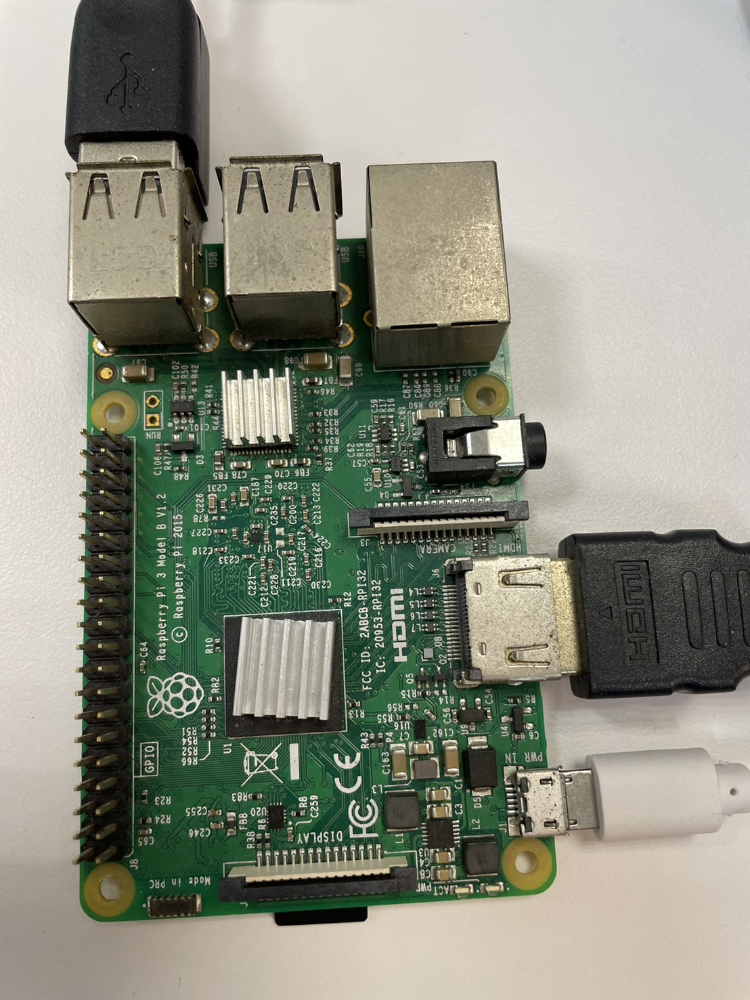
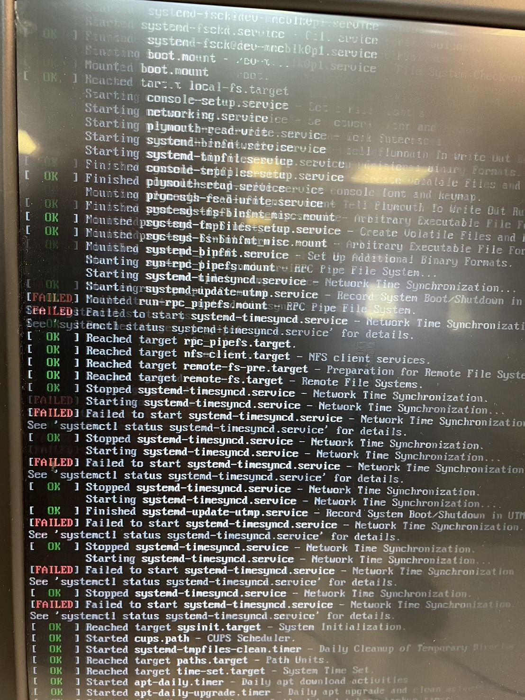
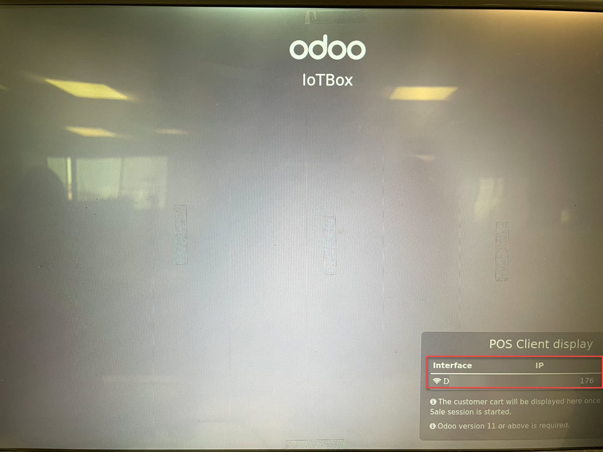
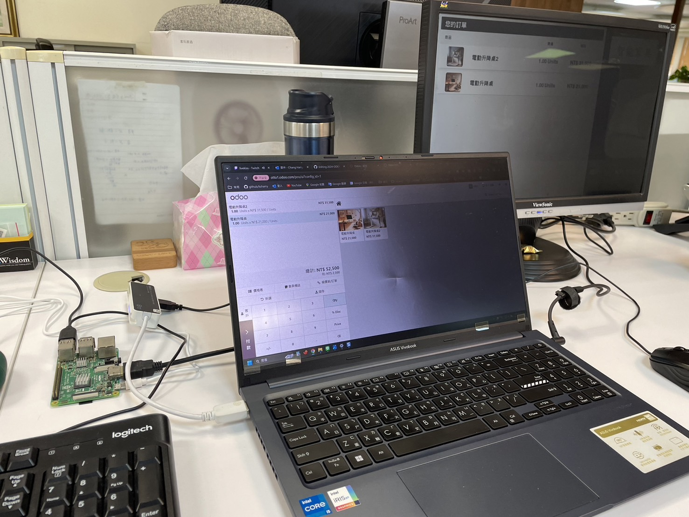

## 總表

## 測試設備清單
1. 使用Respberry Pi 3 Model B。
2. 使用64GB Micro SD卡、讀卡機。
3. 第二套鍵盤、滑鼠、電源、螢幕。

## 下載軟體與映像檔
1. 燒錄軟體balenaEtcher-[下載](https://etcher.balena.io/)

2. 映像檔，最新版適用於任何版本-大小約1.3GB-[下載](https://nightly.odoo.com/master/iotbox/)

## 燒錄映像檔
1. 將Micro SD卡插入讀卡機，放入電腦讀取備用。
2. 將balenaEtcher進行安裝。
3. 執行balenaEtcher將ODOO的IOTBOX的映像檔燒錄到Micro SD內，時間約20分鐘。

## 啟動IOT BOX，並進行連線
1. 將Micro SD卡插入Respberry Pi，並插入相關設備進行啟動，開機畫面

2. 「補充IOT BOX 安裝圖片」啟動後會開啟如下畫面，請將IP記錄下來。

## IOT BOX連線設定WIFI
1. ODOO安裝IOT模組，並連結設備，取得企業版的代碼(TOKEN)

2. 「補充IOT BOX 安裝圖片」將電腦WIFI連線IotBOX-008723808e74
3. 「補充IOT BOX 安裝圖片」透過電腦瀏覽器，輸入IP：10.11.12.1
4. 設定機器名稱與代碼(TOKEN)

5. 設定機器WIFI，後續說明有線的設定

6. 設定完成後，Respberry Pi會自動重新開機。

## ODOO設定配對機器
1. ODOO IOT模組，刷新後，系統自動產生設備，並關聯已連線的設備

2. 透過IOT BOX的首頁，可以進行調整與查看相關資訊

## 系統應用1-POS雙螢幕。
1. 安裝POS，並設定第二個螢幕

2. 開啟POS模組，並開啟雙螢幕

3. 實際配置畫面

## 系統應用2-QC
1. 安裝品質模組，新增檢查，選取拍照，並選取拍照設備。
2. 實際開立一張製造訂單，並開啟計畫。
3. 工場(SHOP FLOOR)使用拍照。

## 小結
1. Model 3B的速度慢，僅測試使用。
2. ODOO的直接列印目前要透過第三方模組或是客製進行調整。
3. ZPL或EPL標籤

## 參考資料
   + ODOO推薦的設備建議-[IOT](https://www.odoo.com/zh_TW/app/iot-hardware)/[庫存](https://www.odoo.com/zh_TW/app/inventory-hardware)/[POS](https://www.odoo.com/zh_TW/app/point-of-sale-hardware)
   + IOTBOX官方文件-[網址](https://www.odoo.com/documentation/17.0/applications/productivity/iot.html)
   + IOT BOX燒錄-[網址](https://www.youtube.com/watch?v=7xlgVrhMhEU)
   + IOT BOX 安裝-[網址](https://www.youtube.com/watch?v=8C6dKREbO70)
   + POS雙螢幕應用-[網址](https://www.youtube.com/watch?v=8C6dKREbO70&t)
   + QC攝影機應用[網址](https://www.youtube.com/watch?v=6uJJnP6452E)
   + POS秤重機應用[網址](https://www.youtube.com/watch?v=hnAcUCZpKuo)
   + POS列印應用[網址](https://www.youtube.com/watch?v=EtPRZDOhwFU)
   + POS直接列印-[網址](https://apps.odoo.com/apps/modules/17.0/printnode_base/)

